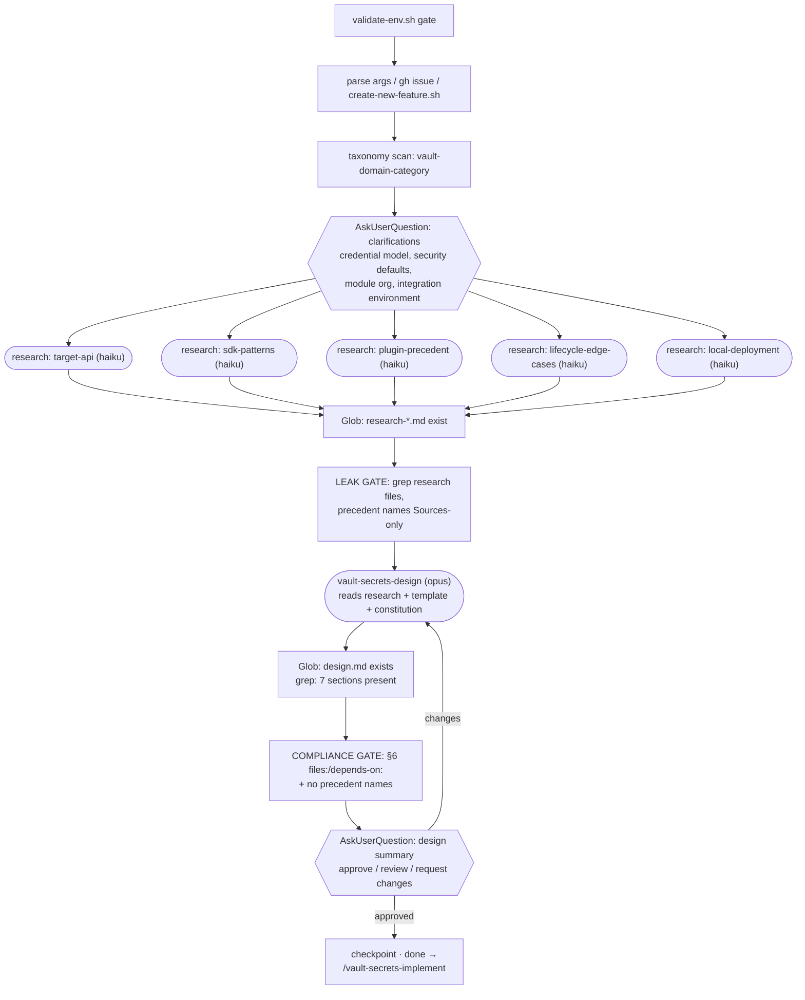
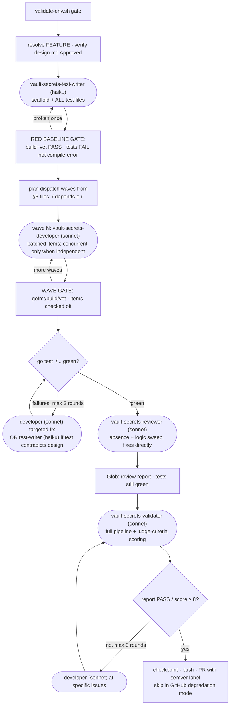
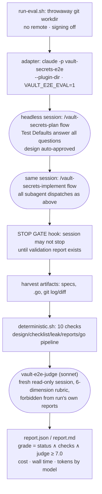

# Agent Dispatch Flows

How each workflow's orchestrator calls agents. Legend: rectangles = scripts /
mechanical gates, rounded = subagent dispatches (model in parens), diamonds =
decision/loop points, double-border = human gate.

## /vault-secrets-plan (Phases 1–2)

Notes: research agents run as parallel foreground Task calls in one message;
each writes `specs/{FEATURE}/research-{slug}.md` and the orchestrator never
reads their contents (Glob only). The PostToolUse `gate-spec-writes.sh` hook
also fires on every research/design file write, feeding violations back to
the writing agent before the orchestrator gates run.

## /vault-secrets-implement (Phases 3–4)

Notes: the `SubagentStop` hook `gate-subagent-go.sh` blocks any developer /
test-writer / reviewer instance from finishing while gofmt/build/vet are
broken — failures feed back into the same instance's context instead of
costing a fresh dispatch. `go test` stays orchestrator-level because
expectations are phase-dependent (red baseline requires failing tests).

## evals/e2e run (wraps both workflows headlessly)

## /vault-db-plan and /vault-db-implement (database plugins)

The database workflow pair has the same dispatch topology as the two secrets
flows above, with these substitutions:

| Secrets flow node | Database flow node |
|---|---|
| taxonomy scan `vault-domain-category` | `vault-db-domain-category` |
| clarifications: credential model, security defaults, module org, integration env | credential features & types, statements contract, security defaults, module org, integration env |
| research slots: target-api, sdk-patterns, plugin-precedent, lifecycle-edge-cases, local-deployment | target-admin-api, sdk-dbplugin-patterns, plugin-precedent, lifecycle-edge-cases, local-deployment |
| `vault-secrets-design` (opus) | `vault-db-design` (opus) — H1 `# Database Plugin Design:` |
| compliance gate closed list `vault-plugin-*` | `vault-dbplugin-connection / -users / -rotation / -integration-testing` |
| `vault-secrets-test-writer` (haiku): backend shell + path tests via HandleRequest | `vault-db-test-writer` (haiku): struct with stubbed `Database` methods + direct-method tests |
| `vault-secrets-developer` (sonnet) per §6 item | `vault-db-developer` (sonnet) per §6 item |
| `vault-secrets-reviewer` (sonnet): bootstrap, client identity, WAL, leases | `vault-db-reviewer` (sonnet): sanitizer coverage, root self-rotation, rollback, idempotent delete |
| `vault-secrets-validator` (sonnet): smoke = mount + config + creds | `vault-db-validator` (sonnet): smoke = catalog register + `secrets enable database` + config write |

Hooks are shared and workflow-agnostic: `gate-spec-writes.sh` accepts both
closed skill lists, `gate-subagent-go.sh` fires on any `hashicorp/vault/sdk`
module, and `gate-eval-stop.sh` keys on `specs/*/design.md` regardless of
H1. The eval harness picks `/vault-db-e2e` when the case directory contains
a `workflow` file reading `db`, and the deterministic design check selects
the DB header set (`## 2. Target System Integration`, `## 3. Plugin
Interface Contract`) from the H1.
